# Django Task Management API

This is a Django-based Task Management API that allows users to create tasks, assign them to users, and retrieve tasks assigned to a specific user. The API follows RESTful principles and supports authentication via Django's built-in user model.

## Features

-   Create a new task

-   Assign tasks to users

-   Retrieve tasks assigned to a specific user

## Getting Started

Follow these steps to set up and run the project on your local machine.

### Prerequisites

Make sure you have the following installed:

-   Python 3.x
-   Django
-   Postman (for API testing)

### Installation & Setup

1. Download the zip file and go into ApiDevelopment folder:

    ```sh
    cd ApiDevelopment
    ```

2. Install dependencies:
    ```sh
    pip install -r requirements.txt
    ```

### Database Setup

1. Make migrations:

    ```sh
    python manage.py makemigrations
    ```

2. Run migrations:

    ```sh
    python manage.py migrate
    ```

3. Populate the database with dummy data:
    ```sh
    python manage.py populate_db
    ```
    The database will be populated automatically when the command executes.

### Running the Server

Start the Django development server:

```sh
python manage.py runserver
```

The API will be available at `http://127.0.0.1:8000/`

## API Endpoints

### 1. Create a Task

-   **Endpoint:** `POST /api/tasks/`

-   **Description:** Allows the creation of a new task with a name, description, and task type.

-   **Request Body:**
    ```json
    {
        "name": "Testing API",
        "description": "After development, test the API",
        "task_type": "Testing"
    }
    ```

### 2. Assign a Task to Users

-   **Endpoint:** `POST /api/tasks/assign/`

-   **Description:** Assigns a task to one or multiple users using task ID and user IDs.

-   **Request Body:**
    ```json
    {
        "task_id": 3,
        "user_ids": [3, 4, 5]
    }
    ```

### 3. Get Tasks for a User

-   **Endpoint:** `GET /api/tasks/user/{user_id}/`

-   **Description:** Fetches all tasks assigned to a specific user.

-   **Response:** Returns a list of tasks (excluding assigned users).

## Testing with Postman

1. Open Postman and create a new request.
2. Select the appropriate HTTP method (GET, POST, etc.).
3. Enter the API endpoint URL.
4. For POST requests, go to the "Body" tab, select "raw," and choose JSON format.
5. Input the JSON data as per the examples above.
6. Click "Send" to execute the request and view the response.

## Media

### Screenshots

1. **Creating a Task (`POST /api/tasks/`)**

    - **Request** - 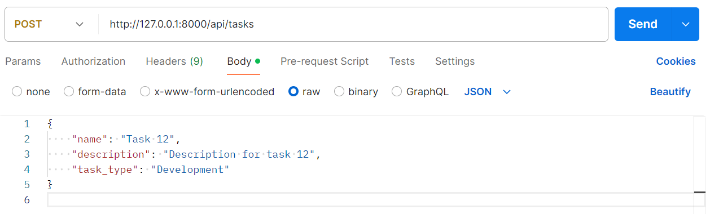
    - **Success Response** - 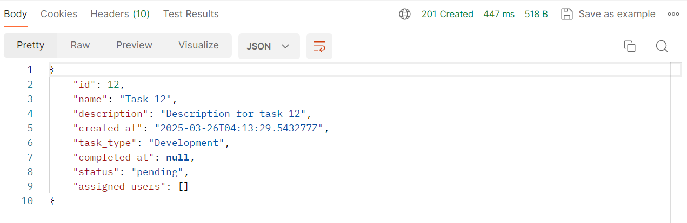
    - **Error Example** - 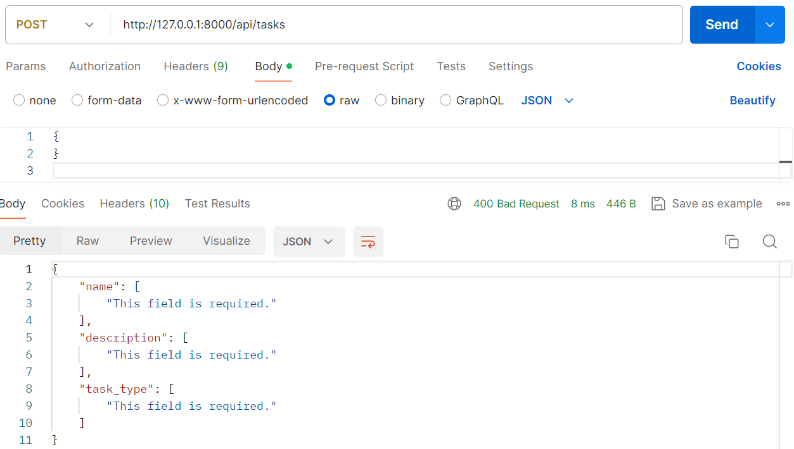

2. **Assigning a Task (`POST /api/tasks/assign/`)**:

    - **Request** - 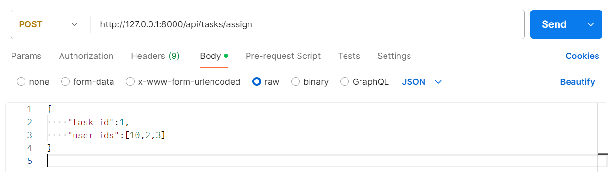
    - **Success Response** - 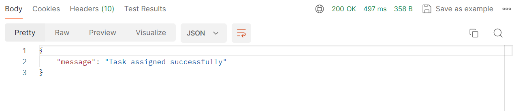
    - **Error Example** - 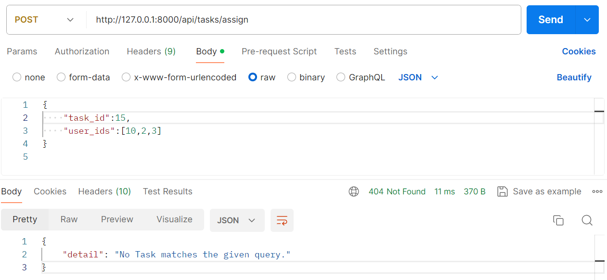

3. **Fetching User Tasks (`GET /api/tasks/user/{user_id}/`)**:

    - **Request** - 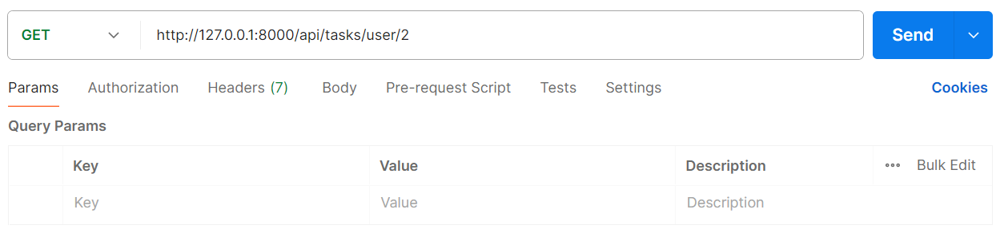
    - **Success Response** - 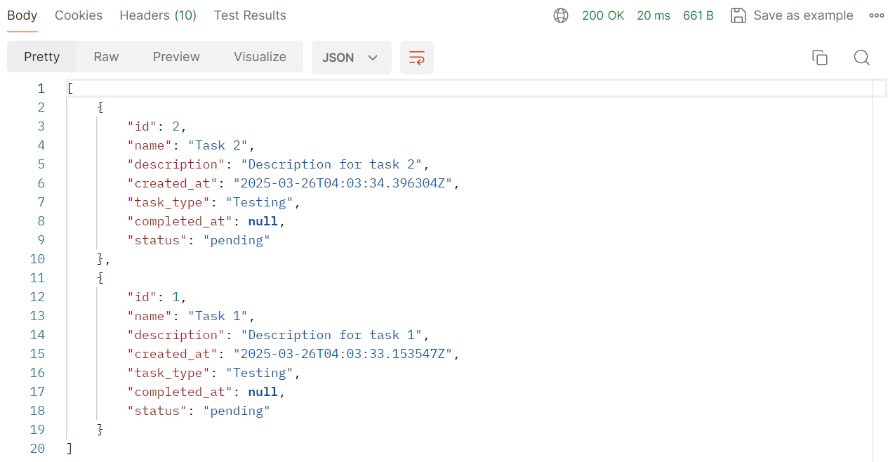
    - **Error Example** - 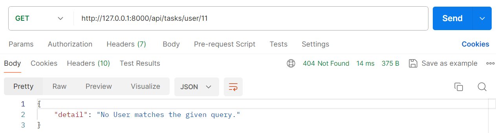

4. **Database Tables**:
    - **Tasks Table** - 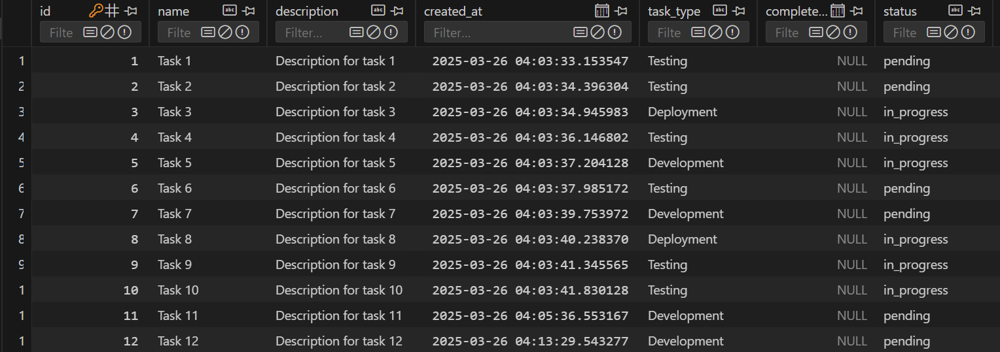
    - **Users Table** - 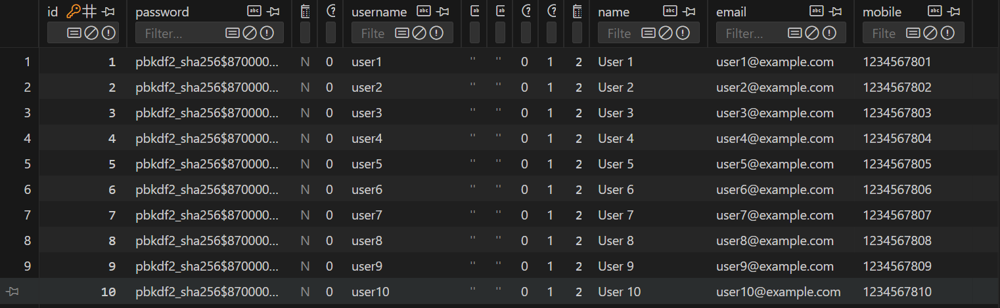
    - **Task Assigned Table** - 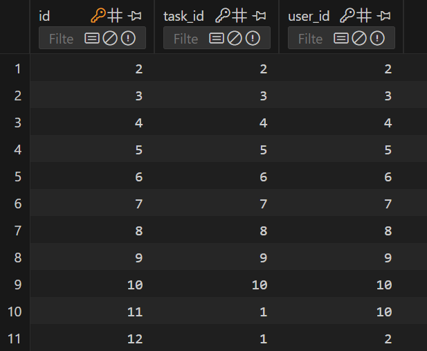

### Video Demo

[Watch Demo Video](https://drive.google.com/file/d/1bpCy_PJEZRo3fDsT6ZuNP4Dgdwhdsb3j/view?usp=sharing)

## Contact

For any questions or support, reach out via:

-   📧 Email: [ujjwal.aggarwal.2305@gmail.com](mailto:ujjwal.aggarwal.2305@gmail.com)

-   📞 Phone: +91 9896445877

-   🔗 [LinkedIn](https://www.linkedin.com/in/ujjwal-aggarwal-3515591ab/)
